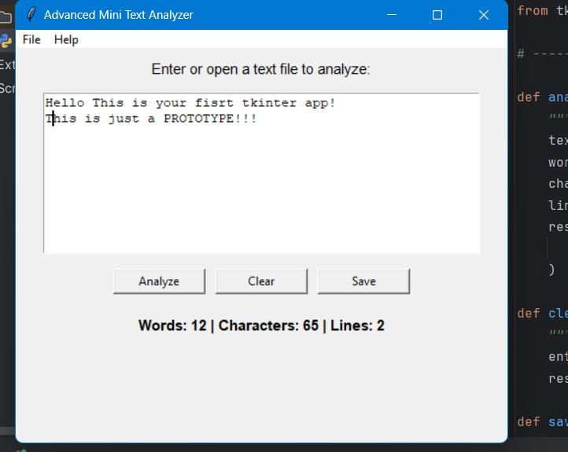

# 🧠 Mini Text Analyzer (Tkinter App)

A simple Python GUI app built with **Tkinter** that performs basic text analysis such as counting words, characters, and sentences.  
This project was created as part of a Python application development exercise and demonstrates how to combine logic and interface design.

---

## 🚀 Features

- 🪶 Clean and minimal Tkinter interface  
- 🔢 Counts words, characters, and sentences  
- 🧮 Displays real-time analysis results  
- 📦 Packaged as a standalone `.exe` file for easy use

---

## 🧰 Tech Stack

- **Python 3**
- **Tkinter** (for GUI)
- **PyInstaller** (for packaging)

---

## 📸 Preview



---

## ⚙️ How to Run

### Option 1 – Run the `.exe` file
Simply double-click `MiniTextAnalyzer.exe` (no Python installation required).

### Option 2 – Run from source
1. Clone the repository:
   ```bash
   git clone https://github.com/YOUR_USERNAME/MiniTextAnalyzer.git
   cd MiniTextAnalyzer
